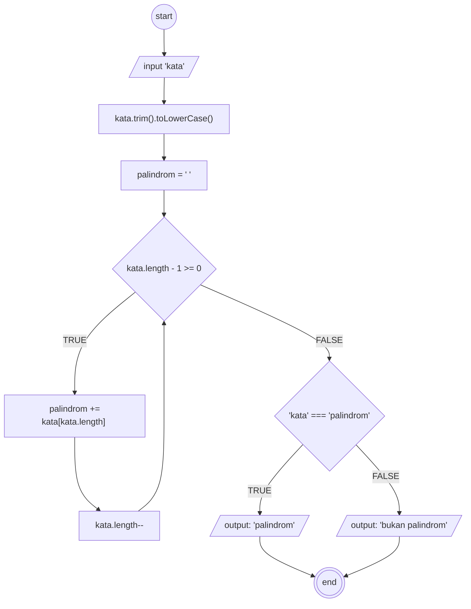
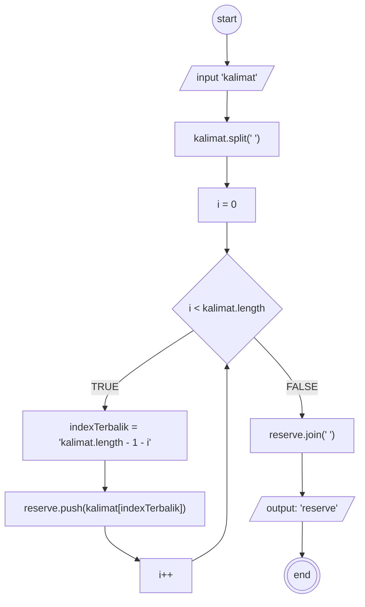

## 1. Deteksi Palindrom

#### Deskriptif

1. mulai
1. masukkan kata sebagai ```kata``` 
1. hapus spasi diawal/diakhir ```kata``` dan ubah ke huruf kecil untuk mengatasi case sensitive
1. buat variabel ```palindrom``` berisi string kosong
1. lakukan perulangan untuk membalikkan kata , selama ```i >= 0``` Tambahkan teks ``i``` ke palindrom lalu kurangi satu
1. lalu bandingkan, jika ```kata``` sama dengan ```palindrom```, maka tampilkan "palindrom"
1. jika tidak, tampilkan "bukan palindrom"
1. selesai


#### Flowchart



## 2. Reserve Words

#### Deskriptif

1. Mulai
1. masukkan kalimat sebagai ```kalimat```
1. pisahkan kalimat menjadi array kata-kata berdasarkan *spasi* ```(" ")```
1. buat array kosong untuk menampung kata-kata yang dibalik sebagai ```reserve```
1. jika index ```i``` (yang dimulai dari 0) lebih kecil dari **panjang array kalimat**, maka lakukan perulangan perhitungan untuk indeks terbalik dengan rumus ```kalimat.length - 1 - i```  secara berurutan sesuai dengan panjang array nya dan di cek lagi untuk kondisi awal, lakukan terus menerus hingga ``i`` tidak memenuhi kondisi
1. jika index ```i``` sudah tidak memenuhi kondisi sebelumnya dan masuk ke dalam ```reserve```, gabungkan kembali kata-kata tersebut menjadi satu kalimat, pisahkan dengan spasi.
1. lalu tampilkan hasil sebagai ```reserve```
1. selesai

#### Flowchart


