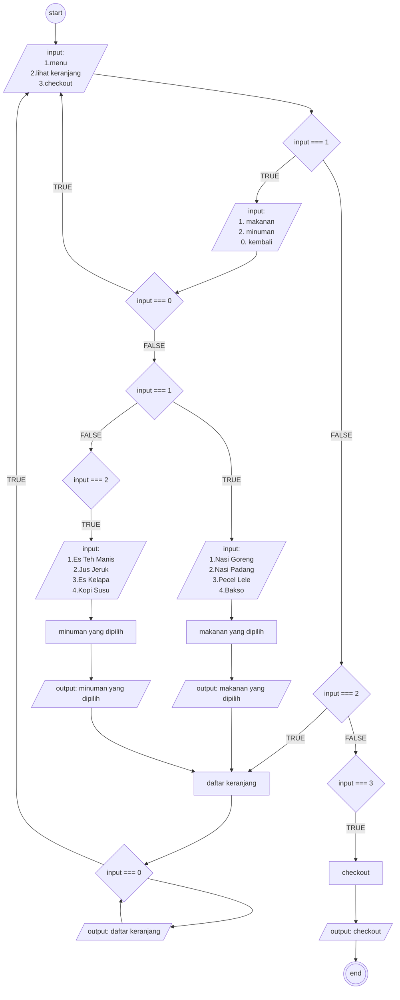

```mermaid

flowchart TD

    a@{shape: circ, label: "start" }
    pilih@{shape: lean-r, label: " input: 
    1.menu 
    2.lihat keranjang 
    3.checkout " }
    des1@{shape: diamond, label: " input === 1 "}
    des2@{shape: diamond, label: " input === 2 "}
    des3@{shape: diamond, label: " input === 3 "}
    makanan@{shape: diamond, label: " input === 1 "}
    iMakanan@{shape: lean-r, label: " input:
    1.Nasi Goreng
    2.Nasi Padang
    3.Pecel Lele
    4.Bakso 
    "}
    pMakanan@{shape: rectangle, label: " makanan yang dipilih "}
    oMakanan@{shape: lean-r, label: "output: makanan yang dipilih"}
    minuman@{shape: diamond, label: " input === 2 "}
    iMinuman@{shape: lean-r, label: " input:
    1.Es Teh Manis
    2.Jus Jeruk
    3.Es Kelapa
    4.Kopi Susu
     "}
    pMinuman@{shape: rectangle, label: " minuman yang dipilih "}
    oMinuman@{shape: lean-r, label: "output: minuman yang dipilih"}
    kembali@{shape: diamond, label: " input === 0 "}
    menu@{shape: lean-r, label: "input:
    1. makanan
    2. minuman
    0. kembali"}
    keranjang@{shape: rectangle, label: " daftar keranjang "}
    dKeranjang@{shape: diamond, label: " input === 0 "}
    oKeranjang@{shape: lean-r, label: " output: daftar keranjang "}
    c@{shape: rectangle, label: " checkout "}
    oc@{shape: lean-r, label: "output: checkout "}
    x@{shape: dbl-circ, label: "end" }

a --> pilih
pilih --> des1
des1 -- FALSE --> des2
des2 -- TRUE --> keranjang
des1 -- TRUE --> menu
menu --> kembali
kembali -- TRUE --> pilih
kembali -- FALSE --> makanan
makanan -- FALSE --> minuman

iMakanan --> pMakanan
pMakanan --> oMakanan

iMinuman --> pMinuman
pMinuman --> oMinuman

oMakanan --> keranjang
oMinuman --> keranjang

minuman -- TRUE --> iMinuman
makanan -- TRUE --> iMakanan

des2 -- FALSE --> des3
des3 -- TRUE --> c --> oc

keranjang --> dKeranjang
dKeranjang -- TRUE --> pilih
dKeranjang --> oKeranjang
oKeranjang --> dKeranjang
oc --> x
```